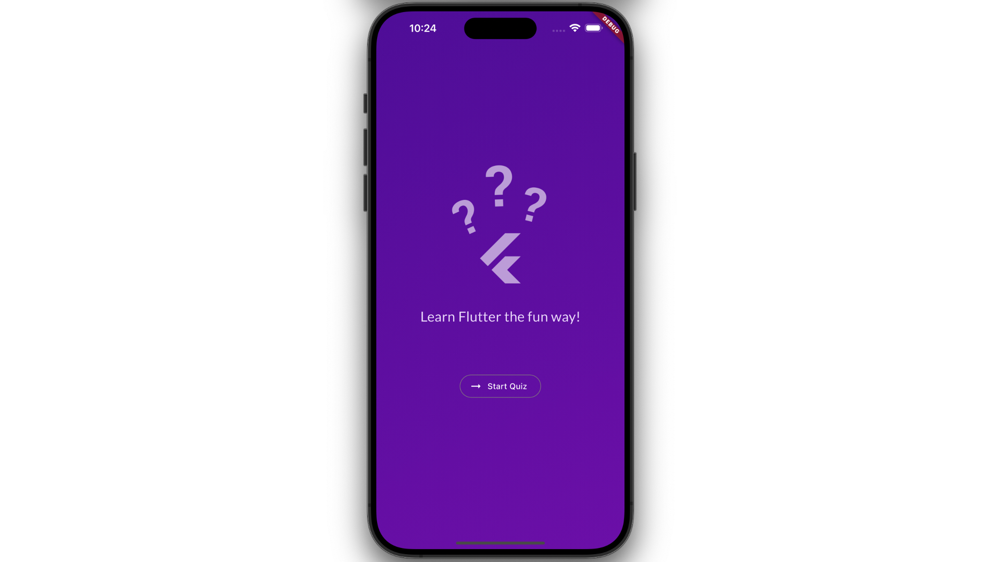

# Quiz App

In this project, utilizing Flutter and Dart to develop a Quiz App focused on basic Flutter knowledge. Once all questions have been answered, the app will display a summary page detailing your choices.

## Features

1. Display the **start screen** with a **"Start Quiz"** button.

   

2. Start answering: In **question screen**, each question will come with four answer choice buttons.

   

3. After answering: Displaying the **result screen** with a **question summary** based on your choices in a scroll view. Indexes with a blue circle indicate correct answers, while those with a pink circle indicate incorrect ones.

4. If you would like to restart the quiz, click the **"Restart Quiz!"** button.

   

## Resources

A few introductory tutorials:

- [List](https://api.flutter.dev/flutter/dart-core/List-class.html)
- [TextStyle](https://api.flutter.dev/flutter/painting/TextStyle-class.html) and [GoogleFonts](https://pub.dev/packages/google_fonts)
- [BoxDecoration](https://api.flutter.dev/flutter/painting/BoxDecoration-class.html)